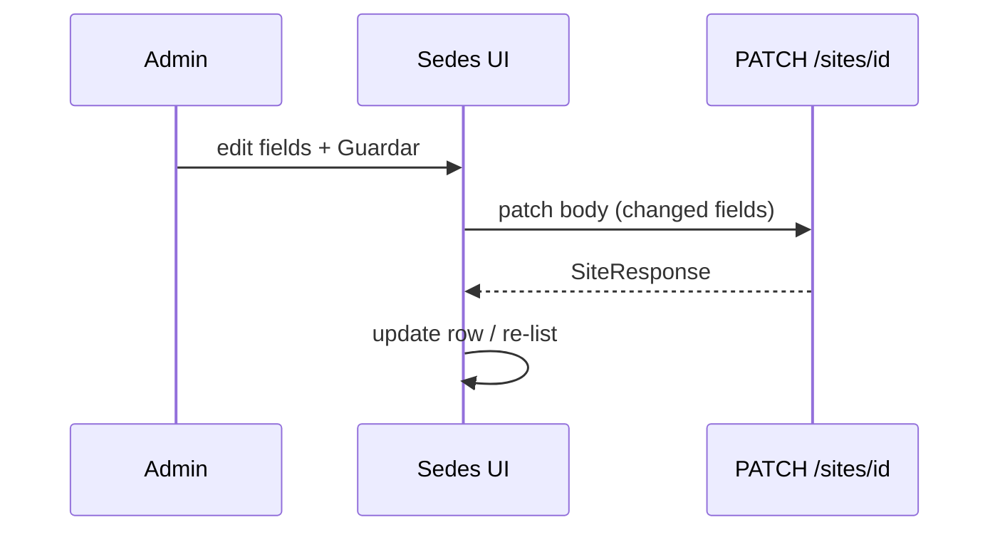

# Design: studio-sites-edit-maps

## Data

```
StudioSite
  + maps_url: str | null  (Text or String(1024+); nullable)
```

Migration revises current head (`005` or whatever is head at apply). Prefer `String(2048)` enough for long Maps share links.

## API

| Method | Path | Notes |
|--------|------|--------|
| GET | `/api/v1/studio/sites` | Return all for admin; include `maps_url` |
| POST | `/api/v1/studio/sites` | Create: name, address?, active (default true), maps_url? |
| PATCH | `/api/v1/studio/sites/{id}` | Partial: name?, address?, active?, maps_url? |
| DELETE | existing soft deactivate | Optional keep; UI may prefer toggle `active` |

### Validation
- `maps_url`: optional; if set, MUST parse as http/https URL (Pydantic `HttpUrl` or custom); empty string → null
- `name`: min length 1

### Lists for pickers
- Rooms create / Series create / Holidays optional site / packs one_sede: offer **active sites only** (unless product already lists all — change to active-only for new assignments)
- Sedes tab: list **all** (active + inactive)

## UI

Sedes tab `StudioAdminPage`:
1. **Create** section: fields name, address, active checkbox (default on), maps_url
2. **List**: each row shows current values as inputs + `Guardar` → `PATCH`
   - maps_url input type `url` or text
   - active checkbox
3. Visual cue for inactive rows (e.g. muted / badge “Inactiva”)

No alumno changes.

## Sequence: inline save



## Testing
- Schema: maps_url optional, invalid scheme rejected
- Service/API: patch updates fields; create stores maps_url
- UI manual: edit active off → disappears from series site select
