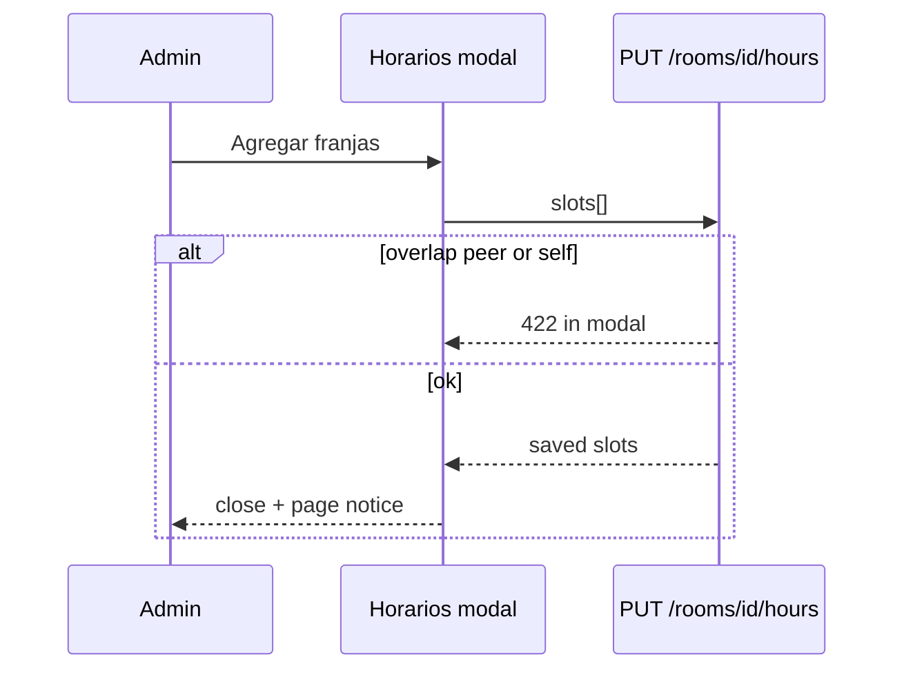

# Design: studio-rooms-edit-hours

## Data

```
StudioRoom
  + default_class_duration_minutes: int  (NOT NULL, default 60)
  + shares_space_with_room_id: UUID NULL  (FK studio_rooms.id, same site; bidirectional pair)

StudioRoomHours
  id UUID PK
  room_id FK studio_rooms
  weekday int 0..6  (0=domingo … 6=sábado, same as admin UI)
  open_time TIME NOT NULL
  close_time TIME NOT NULL  # same calendar day; close > open
  -- multiple rows per room+weekday allowed (008)
```

Closed day = **no rows** for that weekday (not a boolean `is_open`).

### Migrations
| Rev | What |
|-----|------|
| **007** | duration column + hours table (unique room+weekday, `is_open`) |
| **008** | drop unique + `is_open`; multiple slots; times NOT NULL |
| **009** | `shares_space_with_room_id` (file rewritten; do not trust stamp alone) |
| **010** | idempotent: add share column if missing; drop leftover `space_id` / `studio_spaces` |

## API

| Method | Path | Notes |
|--------|------|--------|
| POST | `/studio/rooms` | duration; optional `shares_space_with_room_id` |
| PATCH | `/studio/rooms/{id}` | sede, share peer, name, capacity, duration, active |
| GET | `/studio/rooms/{id}/hours` | `{ room_id, slots: [{ id, weekday, open_time, close_time }] }` |
| PUT | `/studio/rooms/{id}/hours` | replace: `{ slots: [...] }` empty = all closed |

Peer MUST belong to the same site and MUST NOT be self. Linking writes **both** directions. Unlinking clears both.

### Hours overlap (half-open `[open, close)`)
1. Slots of the same room on the same weekday MUST NOT overlap
2. Slots MUST NOT overlap the **shared-space peer** (active only)
3. Adjacent ranges (09–12 and 12–21) MUST be allowed
4. Rooms **without** a peer MAY overlap even in the same site

### Series validation
On `create_series`:
1. Class MUST fit entirely in **at least one** open slot of the room weekday
2. MUST NOT overlap another **active** series in the same room **or** the shared-space peer (same weekday, half-open)

## UI

### Salones
- Create + Editar: checkbox **Comparte espacio físico con otro salón** → combo of other **active** rooms of the selected sede
- Horarios: day + from + to + **Agregar**; grid; **Quitar**; **Guardar horarios**
- Validation `422` from hours/edit MUST render **inside the modal** (`role="alert"`), not on the page behind the overlay
- Success notices MAY appear on the page after the modal closes

### Rejected design
A separate **Espacios** catalog (`studio_spaces` + tab) was implemented then rejected. Source of truth is the room attribute only.

## Tests
- `room_hours_allow_class` containment (half-open)
- `open_time_ranges_overlap` adjacent vs interior
- Site change with active series → 422 (service)

## Sequence: save hours


