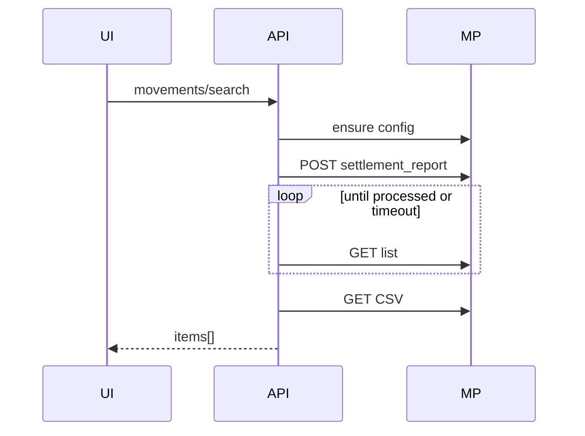

# Design: mp-movements-v1

## Architecture

```
Admin UI (Movimientos)
  → POST /api/v1/mp/accounts/{id}/movements/search
      → ensure_access_token
      → ensure_settlement_report_config (required columns + include_withdraw)
      → POST /v1/account/settlement_report {begin_date,end_date}
      → poll GET /v1/account/settlement_report/list (or search) until status=processed + file_name
      → GET /v1/account/settlement_report/{file_name} (CSV bytes)
      → parse CSV → MovementDto[]
  ← JSON { items }
```

No new DB tables. Tokens remain Fernet-encrypted on `mp_accounts`.

## Config

| Env | Default | Purpose |
|-----|---------|---------|
| `MP_REPORT_POLL_INTERVAL_SECONDS` | `2` | Sleep between list polls |
| `MP_REPORT_POLL_TIMEOUT_SECONDS` | `120` | Max wait for processed report |
| `MP_API_TIMEOUT_SECONDS` | raise default for report calls to ≥60 if needed | HTTP call timeout |

Keep max range **60 days** (same as V1).

## Report config columns (minimum)

`SOURCE_ID`, `TRANSACTION_TYPE`, `TRANSACTION_DATE`, `TRANSACTION_AMOUNT`, `TRANSACTION_CURRENCY`, `SETTLEMENT_NET_AMOUNT`, `EXTERNAL_REFERENCE`, `DESCRIPTION`, `FEE_AMOUNT`, `REAL_AMOUNT`

Also set `include_withdraw: true`, `display_timezone: GMT-03` (Argentina), `header_language: es` when configuring.

## CSV parsing

- Detect delimiter (`,` or `;`) from first line
- Normalize headers to uppercase keys
- Map types → Spanish labels + bucket
- Prefer `SETTLEMENT_NET_AMOUNT` for display amount when present; else `TRANSACTION_AMOUNT` / `REAL_AMOUNT`

## API contract

`POST /api/v1/mp/accounts/{account_id}/movements/search`  
Body: `{ from_datetime, to_datetime }`  
Response: `{ items: MovementDto[] }`  
AdminOnly. Errors: 400 inactive, 404 missing, 422 range, 502/504 MP/report failures.

Remove: `POST .../payments/search` and `mp_payments_service` (tests retargeted).

## Frontend

- Tab rename; copy updated
- Full-viewport-ish loading panel with CSS spinner + “Generando reporte en Mercado Pago…”
- Filters: bucket segmented control, type select, currency, text
- Table columns: Fecha, Tipo, Grupo, Monto, Moneda, ID, Ref. externa, Descripción

## Sequence



## Testing

- Unit: bucket/label mapping; CSV parse sample; range validation
- Manual: prod OAuth account generate report with withdrawals if available
