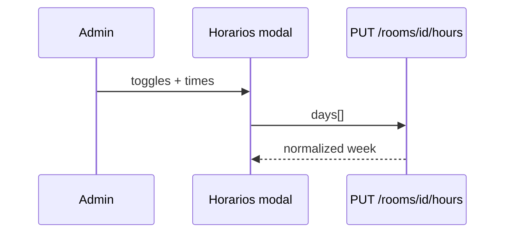

# Design: studio-rooms-edit-hours

## Data

```
StudioRoom
  + default_class_duration_minutes: int  (NOT NULL, default 60 for migration backfill)

StudioRoomHours  (or room_open_windows)
  id UUID PK
  room_id FK studio_rooms
  weekday int 0..6  (0=Sunday ISO-like as existing series weekday)
  is_open bool
  open_time TIME NULL   # required if is_open
  close_time TIME NULL  # required if is_open; > open_time (or next-day forbidden in MVP: same-day only)
  UNIQUE (room_id, weekday)
```

Migration:
1. Add column `default_class_duration_minutes` nullable, backfill 60, set NOT NULL
2. Create hours table

## API

| Method | Path | Notes |
|--------|------|--------|
| POST | `/studio/rooms` | + `default_class_duration_minutes` |
| PATCH | `/studio/rooms/{id}` | sede, name, capacity, duration, active (reject site change if active series) |
| GET | `/studio/rooms/{id}/hours` | list of 7 weekdays (always 7 rows or sparse + UI defaults closed) |
| PUT | `/studio/rooms/{id}/hours` | replace full week schedule body |

### Hours payload example
```json
{
  "days": [
    {"weekday": 1, "is_open": true, "open_time": "08:00:00", "close_time": "21:00:00"},
    {"weekday": 2, "is_open": false, "open_time": null, "close_time": null}
  ]
}
```

Response always normalized to weekdays 0–6.

### Series validation
On `create_series` (and series patch if present):
1. Load room hours for `weekday`
2. If not open → 422 `"Room is closed on this weekday"`
3. Class interval half-open `[start, start+duration)` must satisfy `open_time <= start` and `start+duration <= close_time` (minutes)
4. Capacity ≤ room.capacity (existing)

Optional: default series duration from room when client omits — **not** required (UI series still sends duration).

## UI

### Salones tab
1. Create form: Select sede (active), nombre, capacidad, duración (number min 1, default 60)
2. Filters unchanged
3. Each card/row: name, sede, capacidad, duración, activo + **Editar** (bg teal `#0d9488` or brand-teal) + **Horarios** (amber `#f59e0b`)
4. Modal Editar: form fields + Guardar/Cancelar; overlay accessible (esc / focus trap light)
5. Modal Horarios: table 7 rows Di|Abierto|Desde|Hasta; closed disables time inputs

### Mobile
Stack modals full-width; buttons full-width under each room card.

## Tests
- Normalize empty week = all closed
- Validation series Monday without hours open → 422
- Class ending after close → 422
- Class fully inside open → ok
- Site change with series → 422

## Sequence: save hours


